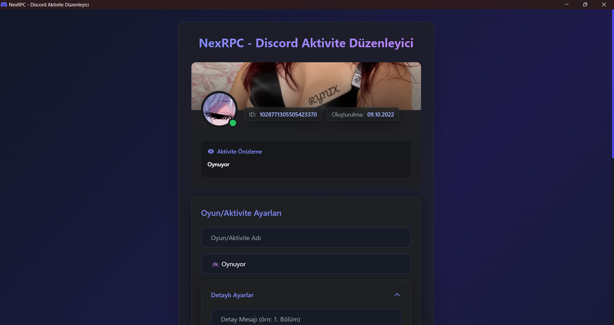
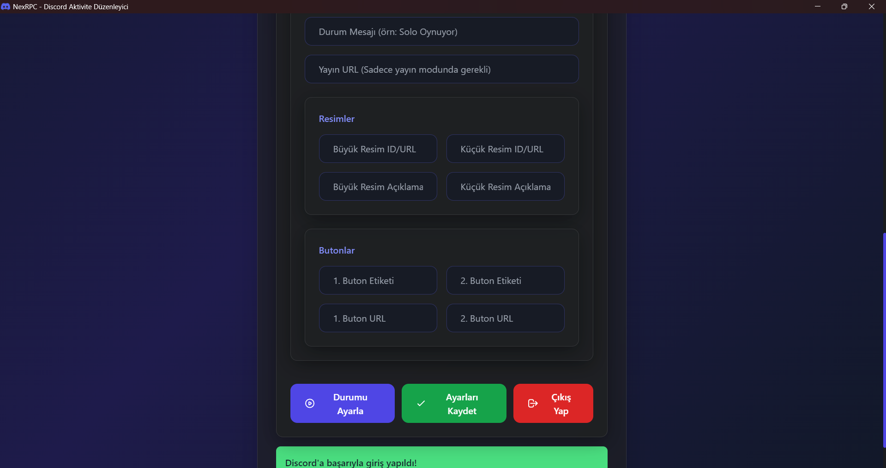
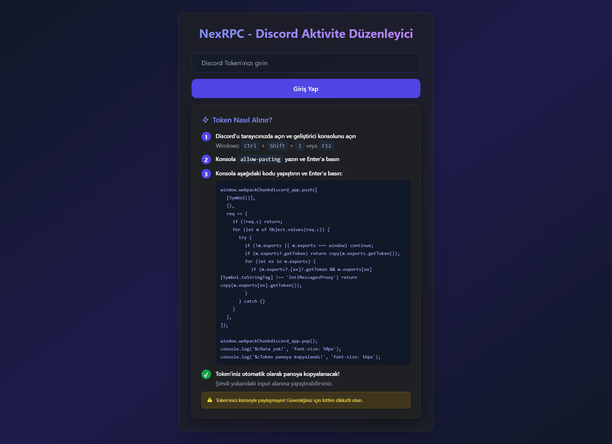

# NexRPC - Discord Aktivite Düzenleyici

NexRPC, Discord profilinizde görünen aktivite durumunu (Rich Presence) tamamen özelleştirmenizi sağlayan, hafif ve performanslı bir masaüstü uygulamasıdır. Sanal makineler (VM) ve düşük donanımlı sistemler için optimize edilmiştir.

## 🌟 Özellikler

*   **Tam Özelleştirme**: Oyun adı, detaylar, durum ve zaman bilgisi ayarlayabilme.
*   **Aktivite Tipleri**: "Oynuyor", "Yayında", "İzliyor", "Dinliyor", "Yarışıyor" seçenekleri.
*   **Görsel Varlıklar**: Büyük ve küçük resim ekleme, resimlerin üzerine gelince çıkan metinleri (tooltip) düzenleme.
*   **İnteraktif Butonlar**: Profilinize tıklanabilir, özel bağlantılı butonlar ekleyin.
*   **Hafif Tasarım**: Sistem kaynaklarını yormayan, VM dostu "Flat Dark" arayüz.
*   **Otomatik Kayıt**: Ayarlarınız ve giriş bilgileriniz bir sonraki açılış için saklanır.

## 🚀 Kurulum ve Kullanım

1.  Uygulamayı başlatın.
2.  Discord Token'ınız ile giriş yapın.
3.  **Aktivite Ayarları** bölümünden istediğiniz bilgileri doldurun.
4.  **Durumu Ayarla** butonuna tıklayarak profilinizi güncelleyin.

## 📸 Ekran Görüntüleri

### Uygulama Arayüzü
Uygulama tek bir pencereden oluşmaktadır. Aşağıdaki görseller uygulamanın üst ve alt kısımlarını göstermektedir:

## 🔑 Token Nasıl Alınır?

Uygulama içerisindeki "Token Nasıl Alınır?" bölümündeki adımları takip ederek tokeninizi güvenli bir şekilde alabilirsiniz.

---

> **⚠️ ÖNEMLİ GÜVENLİK UYARISI**
>
> Discord Token'ınız hesabınızın tam kontrolünü sağlar. Bu tokeni **ASLA** kimseyle paylaşmayın. NexRPC, tokeninizi sadece Discord API ile iletişim kurmak için kullanır ve yerel makinenizde saklar.
